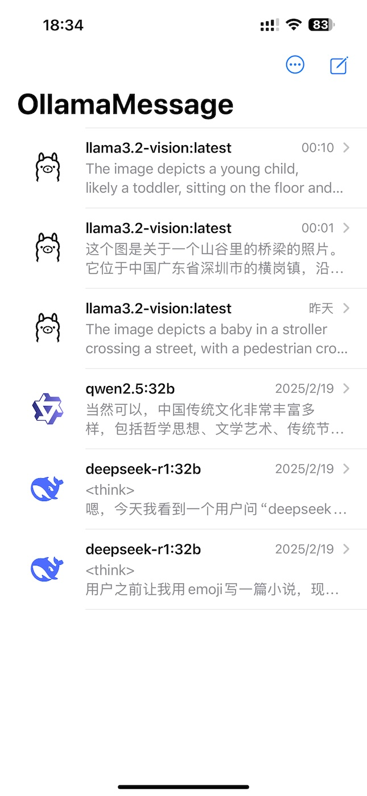

# OllamaMessage

OllamaMessage is an iMessage-style application designed for interacting with the Ollama service. It supports both iOS and macOS, providing a seamless chat experience.

<p float="left">
  
   
   
</p>


## Features

- **iMessage UI Design**: A sleek and familiar chat interface inspired by iMessage.
- **Cross-Platform Support**: Compatible with both iOS and macOS.
- **Ollama Service Integration**: Seamless connection to the Ollama service for intelligent conversations.
- **Message History**: Keeps track of previous conversations for easy reference.
- **Quick Replies**: Enables fast responses for efficient communication.

## Installation

### Requirements

- iOS 16.0, macOS 13.0

### Build from Source

1. Clone the repository:
   ```sh
   git clone https://github.com/lhuanyu/OllamaMessage
   cd OllamaMessage
   ```
2. Open the project in Xcode.
3. Select the target device (iOS or macOS), then build and run the project.

## License

This project is licensed under the [MIT License](LICENSE). Feel free to use and modify it.
